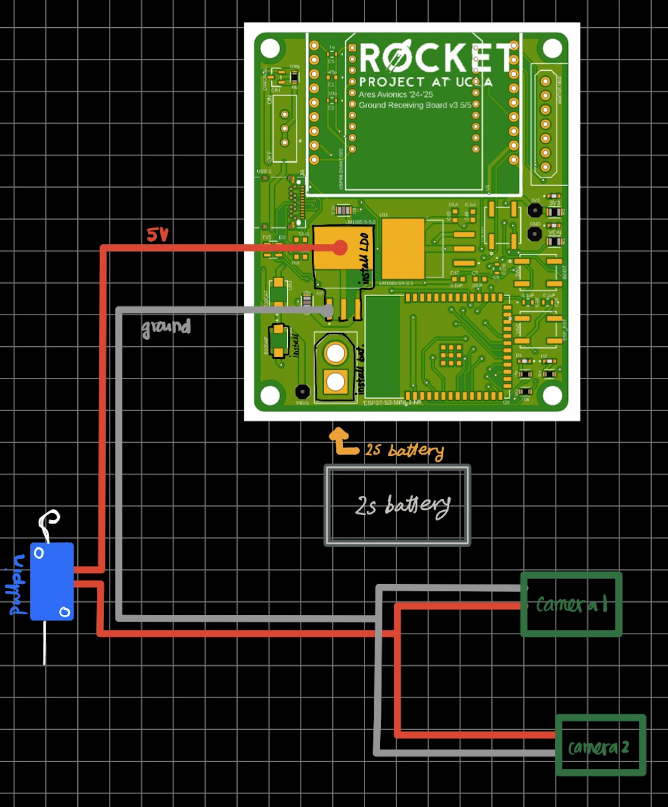
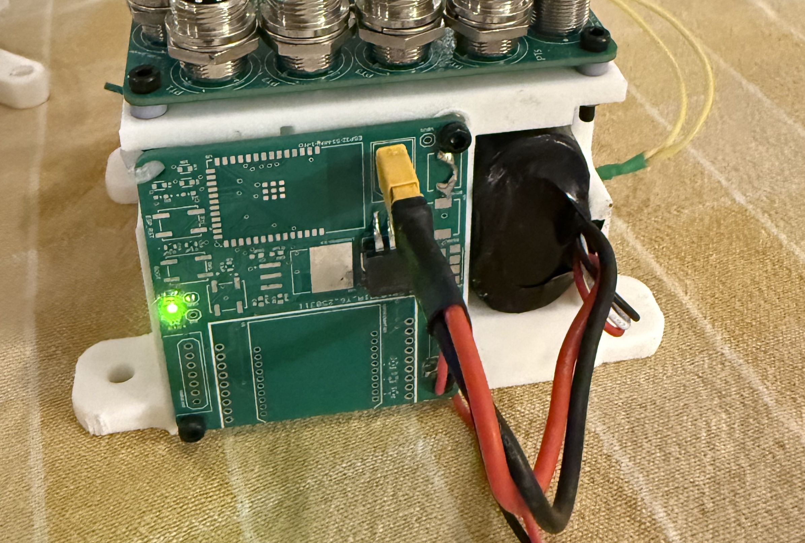

# Rocket Project at UCLA: Ad-Hoc Camera System  
The 2024-2025 Avionics system was not originally going to have a camera, but due to last-minute VE interference, it was decided that two cameras would be added on the rocket. One would be pointed out of the top of the fairing, facing the recovery bulkheads to hopefully capture recovery. The second would be looking out the bottom of the fairing to record the flame during flight.

## About  
After inspiration from Prometheus 2024-2025 Avionics, we decided to use the Black Box Mobius Pro Mini Action Cam for both cameras. Since there was no time to create a custom PCB, I repurposed the Avionics 2024-2025 ground station PCBs to provide power to the cameras. This camera system lived on the same e-housing of the Avionics Bodytube PCB, and thus sat near the lower recovery bulkhead.

The plan was to provide power to both cameras using the output of one 5V LDO (LM1085-5V), with both cameras connected in parallel. Each camera had a USB Mini-B connector, and we were going to splice two USB Mini-B wires and connect the 5V and GND to the output of the LDO. The input to the LDO was just a 7.4V 2S battery, plugged into a socket on the ground station PCB.

The camera was to be placed in a certain mode in which it would immediately start recording and saving to memory once it received power, so the trigger for recording needed to be a pullpin. This pullpin was placed upstream of the parallel junction that powered each camera, so that it would stop current flowing to either camera until it was time to start recording. The pullpin/snap-action switch was to be routed along the raceway, so it could be accessed at the same place in the fairing that held the other pullpins (1x Avionics Bodytube system, 2x Recovery).

These cameras just used a standard SD card, we opted for the higher-storage types, such as the 256/512MB. Each camera by itself (not the PCB) had a custom 3D-printed housing that would be attached to the inside of the fairing, and the fairing had holes cut out for the camera lenses. 

In terms of the power budget, I concluded that one 5V LDO powering two cameras in parallel would be sufficient, since the LDO that was being used (LM1085-5V) had a maximum current output of 3A, and the maximum operating current of each camera was 150-200mA.

