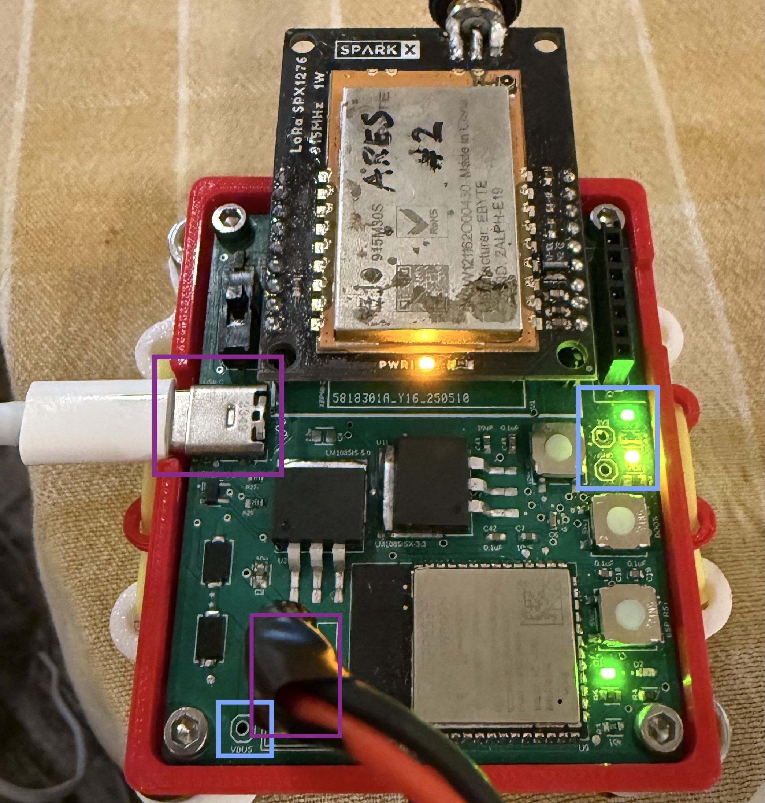
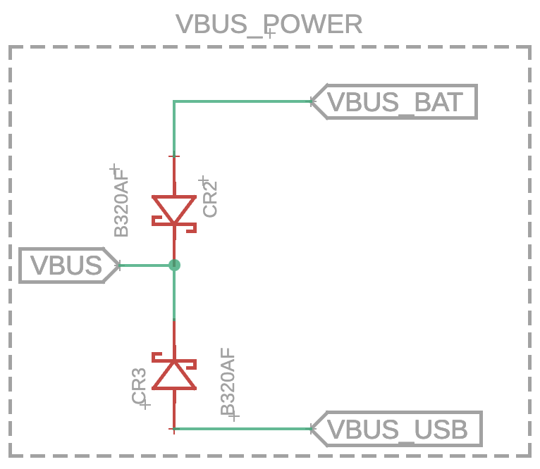
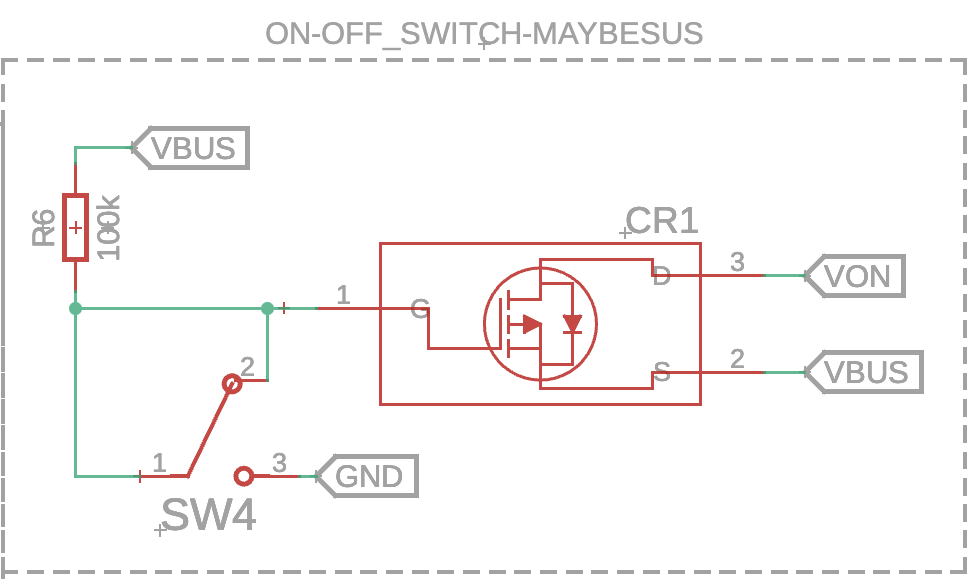

# Rocket Project at UCLA: Ground Station PCB
An overview of the Ground Station PCB, design choices, usage, as well as links to in-depth documentation for all of its functionalities.

## Mechanical choices
The layout and mechanical of the PCB is quite simple overall. At the top of the board can sit either a LoRa radio module or an XBEE radio module, depending on which headers are installed. To the top left of the board, there is a vertical row of headers for an SD card to read data. At the top right of the board, there is an ON/OFF switch controlling all power to all board components. 

The PCB is 2.2in x 2.65in, and is be mounted inside a 3D-printed E-Housing. Note that the E-Housing is essential for good connection between the USB-C port and a USB-C cable, otherwise loose connection may make connecting to the PCB unreliable.

There is a 2S battery socket (XT30-M) near the bottom of the board, and for convenience, the 2S battery is stored in a second printed E-Housing that sits below the PCB E-Housing.

## Serial connection and ESP32
The serial connection between the Ground Station PCB and a computer is by way of a USB-C SMD port on the PCB, this port connects to the USB input of the ESP32 S3 module. 

Note that the serial connection's data rate will not be as fast as a USB-C connection can accommodate, because this data rate will be gated by the data rate of the ESP32.

The ESP32-S3 module is connected to the USB-C port by the D+ and D- lines. The BOOT of the ESP32-S3 (connected to IO0 pin) can be pulled to GND via the BOOT button of the PCB, located on the edge of the board directly below the power lights and test points. Below the BOOT button is the RESET button (connected to ESP32-S3 EN pin), and this button pulls the EN to GND, where it is normally pulled up to 3V3 through a 10k pull-up resistor.

## Power choices
The Ground Station PCB uses two main voltage rails, a 3V3 and a 5V rail.

There are two input power sources for the Ground Station PCB, the USB-C VBUS voltage, and the 7.4V 2S battery socket. Two rectifier diodes are used between each power source, forward biased towards the overall VBUS net on the board. This way, the higher potential connection will power VBUS. If only the USB-C is getting power (~ 5.2V), that will power VBUS, if the 2S battery is plugged in (7.4V), it will power VBUS regardless of the USB-C power.

In order to quickly power cycle the system, there is an ON/OFF switch gating power from the VBUS rail. This switch, controlled by a physical switch controlling a MOSFET, ties VBUS rail to a new rail named VON when the switch is on. If the switch if off, VON rail is pulled to GND and VBUS is left floating. VON must be high in order to power the Ground PCB.

### VREGs

The power from the VON rail is stepped down to 3.3V through the 3V3 LDO (LM1085-3V3), and this 3.3V is used to power the ESP32-S3 module. Additionally, it can be used to power an SD card breakout if one is inserted in the SD card reader, or the XBEE radio module if it is being used.

The power from the VON rail is stepped down to 5V through the 5V LDO (LM1085-5V), and this 5V rail is used to power the LoRa radio.

### Test Points
Labeled test points for this board include a VBUS, 3V3, and GND. Additionally, there are LEDs to indicate 3V3 voltage as well as VON (board power switched on).

## Ground Receiving
The main functionality of the Ground PCB, receiving radio packets from the Nosecone system using a LoRa radio module. Radio connectivity information + code usage information found under `./ground_receive`.

## SD dump
Secondary functionality of the Ground PCB, to easily see file information and print file data from SD card breakout. Code usage information found under `./sd_dump`.

## GUI/Grafana setup
A visualization for the data received from the 'Ground Receiving' code, rather than interpreting values directly from serial prints. Code usage information found under `./GUI`
