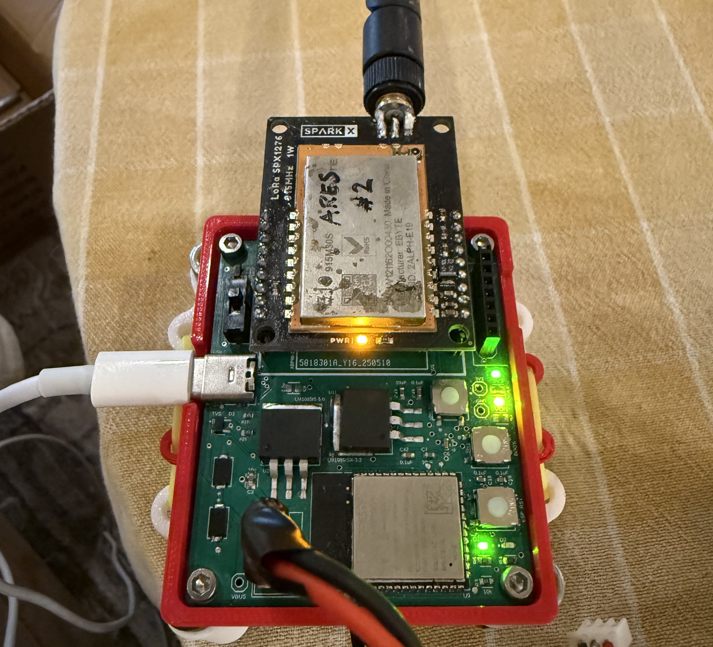

# Rocket Project at UCLA: Ground Receiving Station
The main functionality of the Ground PCB – receiving and printing packets from the Nosecone Avionics system in-flight.  

## Usage
To receive radio packets from the Nosecone system, the 2024-2025 Ground Station uses the LoRa 1W Breakout - 915M30S with a 915MHz-compatible antenna. The onboard ESP32 S3 module connects to this LoRa radio by SPI, and serially connects to the computer by a USB-C port. 

The written code for ground receiving is very simple, it only uses the LoRa radio module in receiving mode and prints the packets to serial with a newline in between each received packet.

Ensure the RX_EN pin gets pulled up in code whenever a packet is being received, and the TX_EN is pulled low. Consult the datasheet for more information on TX and RX enable pin timing and why it is relevant for good communication. 

## Power and Connectivity

As mentioned earlier, the RX_EN pin should be pulled up in receive mode, and TX_EN pulled low.

The radio draws up to 250-400mA of current maximum during any of its operations; the power consumption by receive mode is less than transmit, however. To maximize current flow from the power source, ensure that an LDO with a high output current (such as the LM1085-5V, with max output 3A) is used. The LoRa requires a 5V power supply, and for best connectivity, ensure **no metal** is in the plane of the module – this includes ground planes.

A simple SMA male antenna port is used, with a matching SMA female antenna configured for 915 MHZ. Ensure that the antenna has a low SWR (1.0-1.3) at the desired frequency band of 915 MHz otherwise power will be dissipated.

For this PCB, I routed with wide traces for 5V power to the radio from a power plane, as well as a ground plane supplying ground. Rather than the USB connection from the computer providing the 5V, we opted for a 2S battery stepped down through a 5V LDO to maximize current to the module. 

The ON/OFF switch controlled by a high-current MOSFET gates battery power from the LDOs, and allows for convenient power cycling of the system. 

_Note: Although the USB-C provides a 5V bus voltage, it is not connected to the 5V LDO at all, and rather is stepped down through a 3V3 LDO in order to power the ESP32._