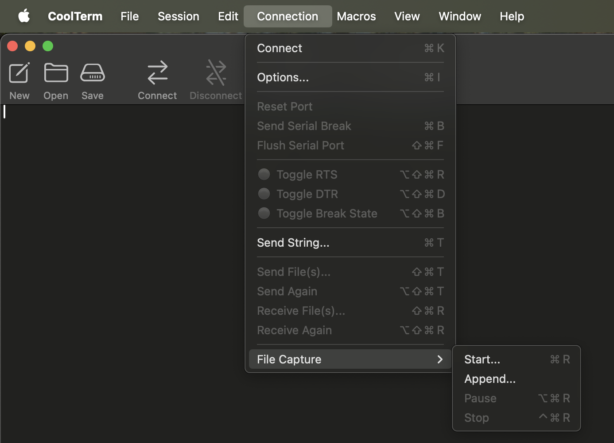
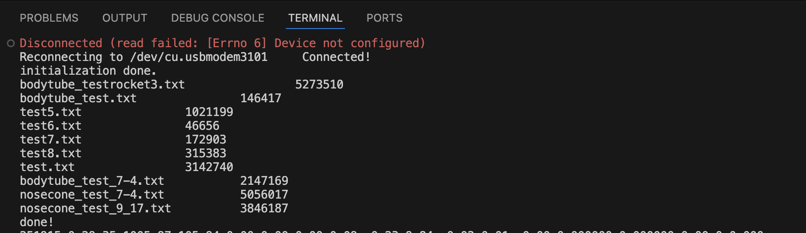
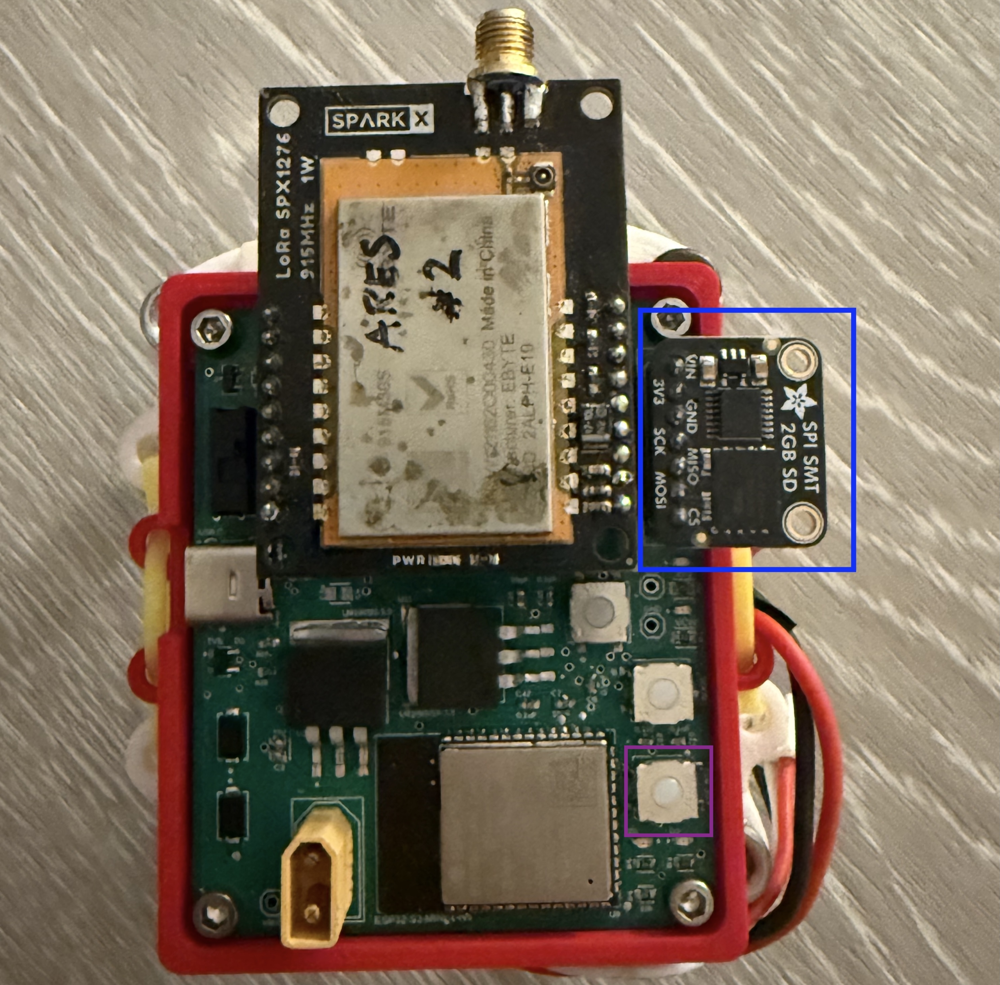

# Rocket Project at UCLA: SD dump
Secondary functionality of the Ground PCB - a convenient way to access the data written on an SD card breakout without overwriting code on other systems.

## Usage
In order to quickly dump SD card data and save it to a file, it's useful to have this functionality built-in to a board. The header/port for the SD card on the Ground Board is compatible with any storage size Adafruit SD Card Breakout as long as it has the same pinout. The commands below will let the SD card function like a 'file system' using Unix-like commands, and by default, the code will have the SD data print to serial.

The SD dump code communicates with the SD card breakout with the ESP32 S3 module via SPI (specifically wired to the HSPI bus in this case). 

### Coolterm  
Although the code will dump to serial monitor and this can be easily observed with the Arduino or VSCode application, neither IDE will give the ability to automatically save to a file. Furthermore, the storage in the Serial Monitor only supports up to 3MB max, making larger SD files difficult to copy in one go. 

Coolterm is a nice alternative to viewing serial monitor output, as it allows you to easily change the Baud rate, view the amount of data downloaded, and can **save to a given file automatically.** 

[Coolterm Installation (Mac)](https://coolterm.macupdate.com/)

By connecting to the Serial port in Coolterm and choosing the appropriate Baud rate, we can start interfacing with Coolterm as if it was any other Serial Monitor. Before SD data begins printing to console, however, we can also start file logging by going to Connection > File Capture > Start... and choosing a file name and directory. Coolterm will write everything printed on the console to this file.

## Commands
The most useful SD dump commands are to list contents of the directory and print the contents. To list, it's as simple as pressing the ESP32 'RESET' button and the information will print to serial. 

The default format for this list is the FILENAME followed by the size in bytes.

In order to print the data in a given file, just use the 'nano' command. The program/code expects serial input from the user, so just type the command

`nano /FILENAME`

followed by ENTER/RETURN key, where FILENAME is the name of the file. If Coolterm is used and it is setup to capture to a file, all data written to serial (command as well as SD data) will be written to the file that it is set to capture to.

**_Note: if using VSCode to do this, VSCode will not print the user-inputted text that was typed to serial. This does not mean the command won't work, you just won't be able to see your text being typed on the monitor._**
